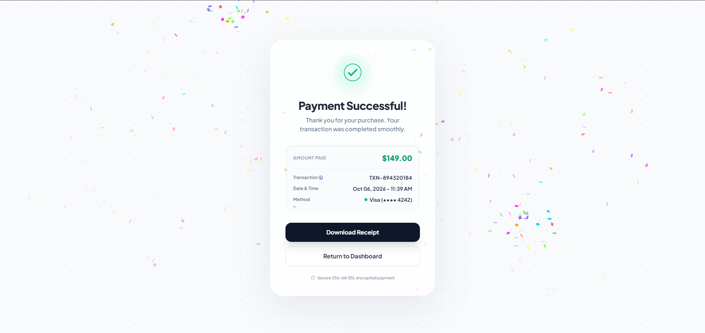

# Success Payment UI

A polished payment success page built as a static HTML interface. The design combines a soft dot-grid background, glassmorphism card, animated success checkmark, transaction summary, and premium action buttons.

## Overview

This project is a front-end mockup for a successful checkout confirmation screen. It is designed to feel like a SaaS or fintech payment confirmation experience and is implemented as a single-page HTML file with Tailwind CSS and a small script for dynamic time and confetti animation.

## Included in the page

- Bright success state with animated checkmark
- Glassmorphism card layout with soft shadow and blur
- Dot-grid background pattern
- Transaction summary with amount, ID, time, and payment method
- CTA buttons for download receipt and dashboard return
- Live timestamp generated in the browser
- Confetti animation on page load
- Secure SSL badge
- Responsive layout for desktop and mobile screens

## Tech stack

- HTML5
- Tailwind CSS via CDN
- Google Fonts
- JavaScript for interactivity and animation

## Project structure

```bash
.
├── index.html
├── README.md
├── img/
│   └── UI.png
└── .git/
```

## Preview



## Run locally

Because this is a static page, there is no build process required.

1. Open the project folder in a browser, or
2. Start a local server from the project root.

Example:

```bash
cd /workspaces/success-payment-ui
python3 -m http.server 8000
```

Then open:

```text
http://localhost:8000
```

## Main details shown on the page

- Title: Payment Successful!
- Message: Thank you for your purchase. Your transaction was completed smoothly.
- Amount: $149.00
- Transaction ID: TXN-894320184
- Method: Visa ending in 4242
- Security note: Secure 256-bit SSL encrypted payment

## Customization

You can easily update:

- Amount paid
- Transaction ID
- Date/time format
- Payment method label
- Button text
- Color palette and card styling


## ✨ Contact

<div align="left">
  <a href="https://webdeveloperprianka.netlify.app/" target="_blank"> 
    
  </a>
  <a href="https://www.linkedin.com/in/fatema-akther-prianka/" target="_blank">
    
  </a>
  <a href="https://stackoverflow.com/users/23182049/prianka-mimi" target="_blank">
    
  </a>
  <a href="https://leetcode.com/u/prianka-mimi/" target="_blank">
  
  </a>
    <a href="mailto:priankamimi0204@gmail.com" target="_blank">
    
  </a>
  <a href="https://discord.com/channels/@me" target="_blank">
    
  </a>